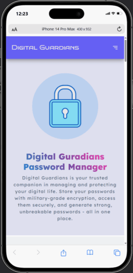
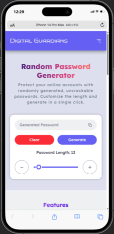
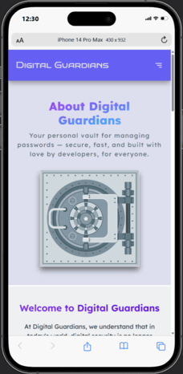

# 🔐 Digital Guardians - Full Stack Password Manager

**Digital Guardians** is a secure, high-performance password manager built with the MERN stack (MongoDB, Express, React, Node.js). It allows users to manage passwords safely, generate strong random passwords, and store them in an encrypted vault.

## 🆕 What’s New in 2025

- **Server Migrated to TypeScript**: Backend now fully in TypeScript for type safety and maintainability.
- **Zod-based Form Validation**: Inline error messages for safer and cleaner user input handling.
- **Centralized TypeScript Types**: Consistent, maintainable type definitions across the entire codebase.
- **Structured & Scalable Folder Architecture**: Easier to maintain and extend.
- **Safer, Modern Codebase**: Updated dependencies and best practices for security and maintainability.
- **Improved UI/UX**: Mobile-first, responsive design with Tailwind CSS.

## 📸 Screenshots

  

## 🚀 Features

- **Secure Authentication**: Signup/login with JWT-based authentication.
- **Password Vault**: Save, edit, delete, and search credentials securely.
- **Random Password Generator**: Generate strong, random passwords with one click.
- **Encrypted Storage**: Passwords are encrypted before being saved in the database.
- **Real-Time Sync**: Fast state updates using TanStack Query on the frontend.
- **Responsive Design**: Mobile-first, modern UI powered by Tailwind CSS.

## ⚙️ Tech Stack

### Frontend:

- **React.js + TypeScript**: Modern UI with type safety.
- **Tailwind CSS**: Utility-first styling framework.
- **React Router v7**: Client-side routing.
- **TanStack Query**: Data fetching and caching.
- **Zod & React Hook Form**: Form validation and handling.
- **Vite**: Fast build tool for development.

### Backend:

- **Node.js & Express.js**: RESTful API backend.
- **TypeScript**: Strongly typed backend for better maintainability and safety.
- **MongoDB & Mongoose**: NoSQL database and ODM.
- **JWT & Bcrypt**: Secure authentication and password hashing.
- **Zod**: Runtime schema validation for safe and consistent data handling.
- **Cookie-Parser & Dotenv**: Cookie handling and environment management.

## ⚙️ Installation

- [Frontend (client)](https://github.com/MohammadAsad-Weber/digital-guardians/tree/main/client#%EF%B8%8F-getting-started)
- [Backend (server)](https://github.com/MohammadAsad-Weber/digital-guardians/tree/main/server#%EF%B8%8F-getting-started)

## 🤝 Contributing

If you would like to contribute to this project, feel free to fork the repository, make changes, and create a pull request. Please ensure your changes are well-documented and tested.

## 📜 License

This project is licensed under the ISC License - see the [LICENSE](./LICENSE.txt) file for details.

## 📬 Contact

For any questions or issues, feel free to reach out via the GitHub issues section or contact me directly through my GitHub profile.

- **Github**: [@MohammadAsad-Weber](https://github.com/MohammadAsad-Weber)
